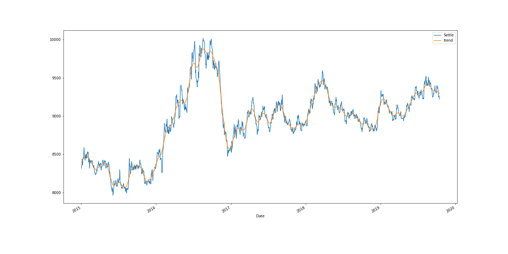
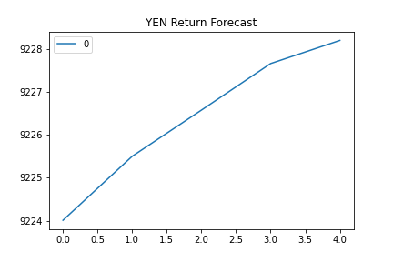
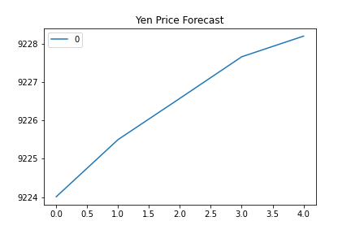
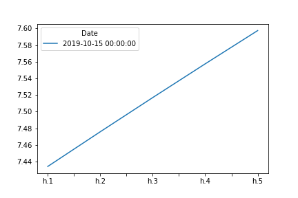
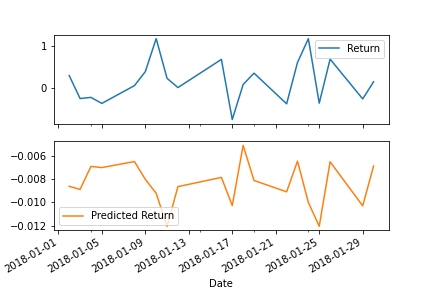

# Unit-10-A-Yen-for-the-Future

### By Mikhara Ramsing

# Time Series Analysis Conclusions

### Trending upwards
Appling the HP Filter to decompose our Settle prices into trend and non-trend (noise) components, we can observe that there was a rapid upward trend from 2016-2017 with a crash occurring in 2017. The crash in 2017 is most likely a result of the USD experiencing a consistent decline in that year, what some had labelled - "The Trump Slump" (https://internationalbanker.com/brokerage/us-dollar-consistently-falling-throughout-2017/).

The trend continues upward, at a more gradual pace, from the crash in 2017-2020. Based on the HP Filter trend data, I would buy the Yen now, expecting a continuation of an upward trend. Let's see what our forecasting models say!

### ARMA
Based on the 5 day forecast plotted by the ARMA model, we would not want to buy the Yen now, its expected the price with drastically fall. However, the ARMA model is not a good fit, with a p-value above 0.05, hence not statisfically relevant. Would not use this model for trading.

### ARIMA
Whilst the ARIMA model predicts that Yen prices will increase in next 5 days, the p-values being above 0.05 also indicate that this model is not a good fit. Would not use this model for trading.

### GARCH

The Garch model is statistically significant, with a p-value less than 0.05. Based on the upward trend in the forecast plot, the exchange rate risk is expected to increase over the next 5 days. And interestingly risk is expected to increase in a liner, proportionate fashion!

In conclusion, based on HP Filter and GARCH model showing volatility, will most likely not buy Yen now.

# Regression Analysis Conclusions

The RMSE for our Out of Sample Performance is 0.42 whereas the RMSE for our In Sample Performance is 0.60 (rounded up to two decimal places), therefore the Out of Sample Performance (the one based on testing data) is a better model fit than the In Sample Performance. Ie the model performs better on out-of-sample data than in-sample data.

